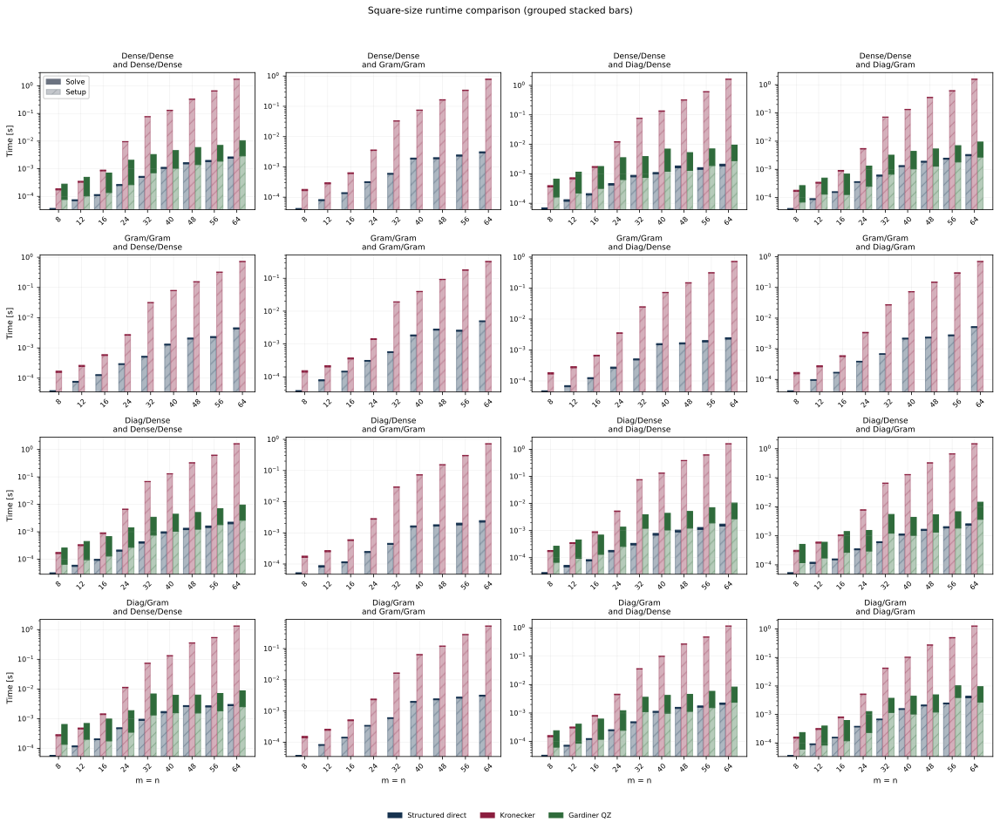
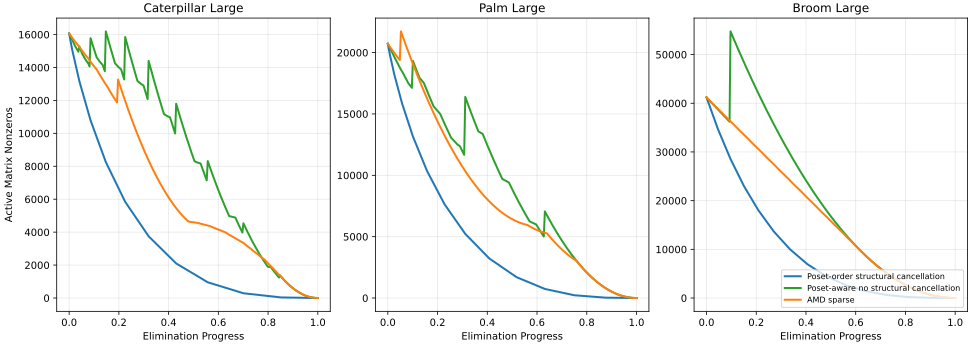

# Motivation

Numerical linear algebra is the core computational engine behind the vast majority of optimization algorithms. A central bottleneck in many algorithms is the efficient solution of linear systems. It is therefore unsurprising that a vast amount of research on solving linear systems exists. While many algorithms exist for solving general linear systems, it is often the case that specialized algorithms that target a structured subclass of linear systems can do better.

During my dissertation work, I encountered two highly structured linear systems that we were interested in solving more efficiently.

# Positive Semidefinite Generalized Sylvester Equations

We consider a method for solving generalized positive semidefinite Sylvester matrix equations of the form

$$
P_l X P_r + Q_l X Q_r = G,
$$

where

$$
\begin{aligned}
P_l, Q_l &\in \mathbb{S}_+^m, \quad P_r, Q_r \in \mathbb{S}_+^n, \\
G &\in \mathbb{R}^{m \times n}, \quad X \in \mathbb{R}^{m \times n}.
\end{aligned}
$$

These systems of equations arise naturally in matrix-valued optimization, optics, the discretization of partial differential equations, and other computational fields.

## Results

We describe a direct-factorization-based approach to solving this equation which involves working with the matrices in pairs $(P_l, Q_l)$ and $(P_r, Q_r)$.

By working with these matrices in pairs, we are able to solve dense instances in $\mathcal{O}(m^{3} + n^{3})$ time and can avoid forming larger Kronecker products of matrices which require $\mathcal{O}(m^{3}n^{3})$ time to solve.
Additionally, our method will rely only on simple, optimized linear algebra subroutines such as the Cholesky, singular value, and QR decompositions and can be adapted to additional special structure.

Below, we compare the runtime of our method against a generic method for solving the equation using Kronecker vectorization and a different structured method in the literature. Our solver is in blue, and we see an order of magnitude improvement.

# Poset Structured Least Squares

We consider the linear system that encodes the optimality condition of the following matrix least squares problem

$$
\begin{aligned}
    \min~       & \|A - CXB\|_{F}^{2} \\
    \text{s.t.}~ & X \in \mathcal{I}(\mathcal{P})
\end{aligned}
$$

where $A,~B,~C,~X$ are all constrained to be block lower triangular, and the sparsity pattern on the lower triangular part is the transitive closure of a DAG, also known as a partially ordered set (poset).

This type of problem arises naturally when considering problems with constraints on the flow of information, such as networks of dynamical systems.

The linear system that arises here is highly structured, but not particularly sparse. However, we show that the poset defines a natural order-theoretic way to solve the linear system more efficiently than the general theory of sparse linear algebra implies. In short, certain magic cancellations happen if the linear system is solved a particular way. We compare the proposed method to a standard sparse baseline for solving the system, as well as a baseline where the magic cancellations are not tracked.

